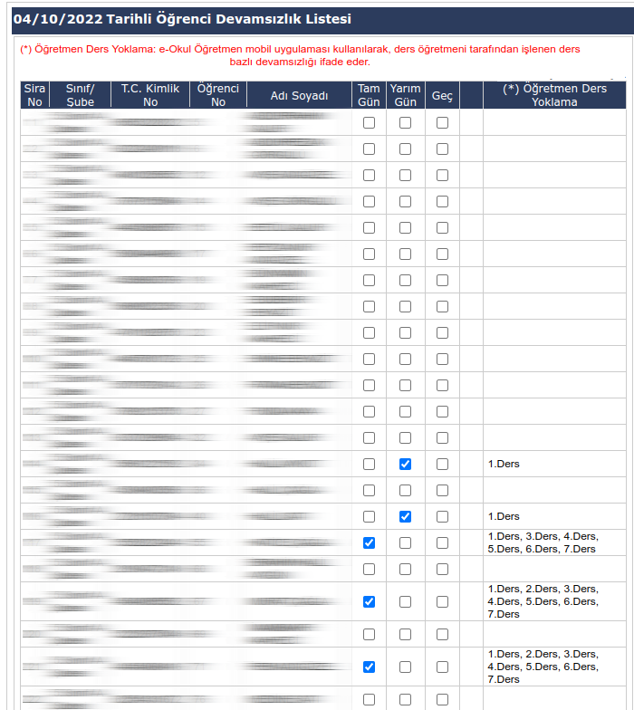

# E-okul-Devamsizlik
Eokula e-Okul Öğretmen üzerinden girilen devamsızlıkları otomatik işaretleyen chrome eklentisi


# 📌 E-okul Devamsızlık Otomatik İşaretleyici

🧑‍🏫 **E-okul Devamsızlık**, MEB e-Okul sisteminde öğretmen modülüne girilen yoklamaları otomatik olarak işaretleyen bir **Chrome eklentisidir**.

Bu eklenti sayesinde her öğrenci için tek tek yoklama işaretlemek zorunda kalmadan, sınıfın devamsızlık durumu otomatik olarak doldurulur. Basit, hızlı ve güvenlidir.

---

## 🚀 Özellikler

- ✅ e-Okul Kurum Devamsızlık paneli ile uyumlu
- ✅ Öğrenci listesinde devamsızlık kutularını otomatik işaretler
- ✅ Kullanıcı dostu arayüz
- ✅ Manuel veya toplu seçim seçenekleri (güncellemeyle eklenebilir)
- ✅ Zaman kazandırır, hata oranını düşürür

---

## 📸 Ekran Görüntüleri

### 🔹 Devamsızlık Arayüzü


### 🔹 İşaretleme Ekranı


---

## 🔧 Kurulum (Manuel Yükleme)

> Bu eklenti henüz Chrome Web Mağazasında yayınlanmamıştır. Manuel olarak yükleyebilirsiniz.

### 1. Depoyu klonlayın veya ZIP dosyası olarak indirin

```bash
git clone https://github.com/kullaniciadi/E-okul-Devamsizlik.git
```

Alternatif olarak, sağ üstten Code > Download ZIP ile projeyi indirip çıkarabilirsiniz.

2. Chrome'da Geliştirici Modunu Açın
Chrome tarayıcısını açın ve adres çubuğuna chrome://extensions/ yazın.
Sağ üstteki **"Geliştirici modu"**nu etkinleştirin.
"Paketlenmemiş öğe yükle" butonuna tıklayın.
Bu klasörü seçin: E-okul-Devamsizlik/
🎉 Eklenti artık tarayıcınızda aktif!

▶️ Kullanım

e-Okul Öğretmen Girişi sayfasına gidin.

İlgili sınıfın devamsızlık ekranını açın.

Chrome araç çubuğundaki eklentiyi tıklayın.

Eklenti devamsızlık alanlarını otomatik olarak işaretleyecektir.

Gerekirse elle düzenleme yapabilirsiniz.

⚠️ Uyarılar

Bu eklenti yalnızca kurum idarecileri için geliştirilmiştir.

MEB sisteminde yapılan değişikliklerde eklenti çalışmayabilir. Geliştirici güncelleme yapana kadar beklemeniz gerekebilir.

Eklenti, resmi bir kurum tarafından geliştirilmemiştir. Kullanım tamamen kişisel sorumluluktadır.

🛠️ Geliştirici Notu

Proje açık kaynaklıdır. Her türlü katkıya açıktır. Pull request göndererek geliştirmeye destek olabilirsiniz.

📄 Lisans

Bu proje MIT lisansı ile lisanslanmıştır. Detaylar için LICENSE dosyasına bakınız.

🙋 Sık Sorulan Sorular

Q: Eklenti neden otomatik yüklenmiyor?
A: Chrome, mağaza dışı yüklemelerde manuel kurulum zorunluluğu getirir. Bu nedenle Geliştirici Modu kullanılır.

Q: e-Okul sisteminde güncelleme oldu, eklenti çalışmıyor.
A: Lütfen GitHub Issues kısmından durumu bildirin, güncelleme yapılacaktır.
